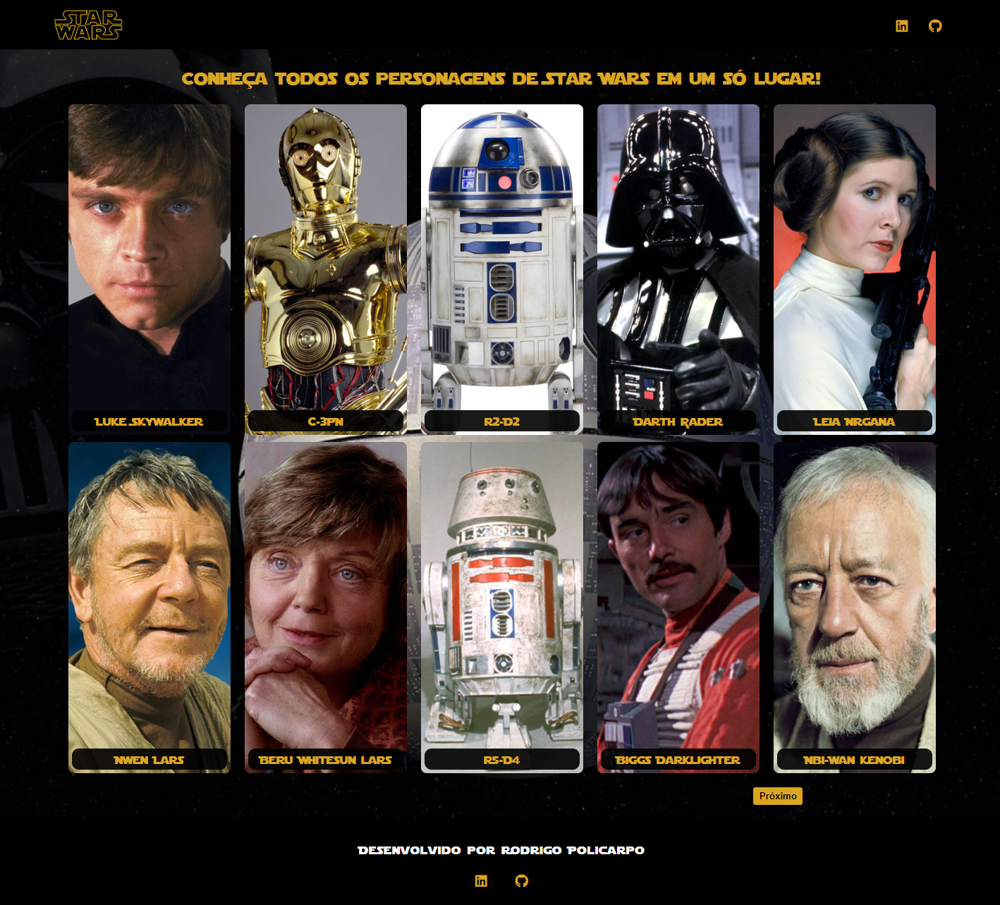
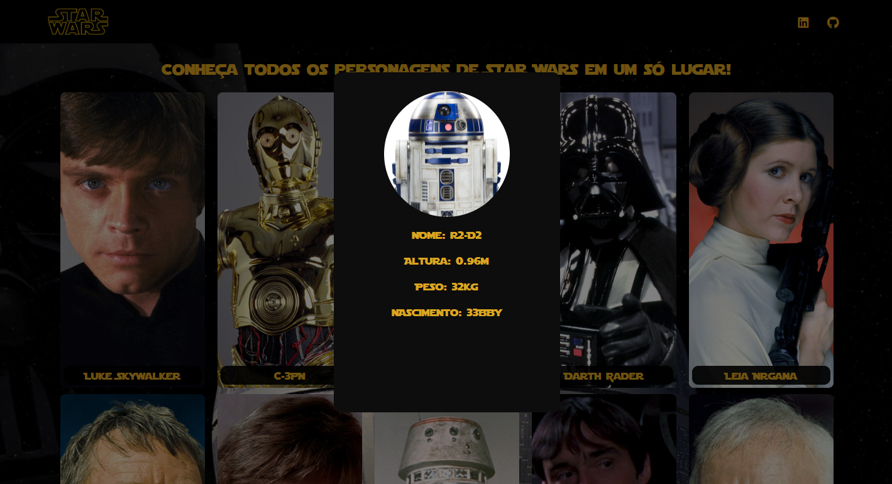

# Projeto Personagens Star Wars

Um projeto com foco em JavaScript, utilizando uma API com personagens de Star Wars.

## Índice
- <a href="#funcionalidades-do-projeto">Funcionalidades do Projeto</a>
- <a href="#layout">Layout</a>
- <a href="#demonstração">Demonstração</a>
- <a href="#tecnologias-utilizadas">Tecnologias Utilizadas</a>
- <a href="#desafios-no-desenvolvimento">Desafios no Desenvolvimento</a>
- <a href="#documentação-da-api">Documentação da API</a>
- <a href="#sobre-o-desenvolvedor">Sobre o Desenvolvedor</a>

## Funcionalidades do Projeto
- Utilização de API (JavaScript)
- Responsividade com aparelhos móveis

## Layout
Tela inicial

Modal com detalhes do personagem

## Demonstração
Demonstração do projeto em tela desktop

## Tecnologias Utilizadas
- HTML
- CSS
- JavaScript
- Git / GitHub

## Desafios no Desenvolvimento
Este foi o projeto criado com base nas aulas do curso Profissão Programador. Foi o projeto com maior utilização da linguagem JavaScript desenvolvido por mim até o momento, além de ser o que mais me dei liberdade no quesito de desenvolvimento e estilização. Busquei ao máximo o conceito de Clean Code, criando um código limpo, sem repetições e comandos desnecessários, com identação e semântica correta. Alguns pontos de destaque no desenvolvimento do código, que apresentaram alguns desafios, foram:

- Fazer a integração da API ao código foi um dos pontos que mais demandaram tempo e atenção, dada a leve complexidade de implementação.
- Responsividade para telas mobile, utilizando Media Query, feitas a partir do zero por mim mesmo.

## Documentação da API
- <a href="https://swapi.dev/?_gl=1*1p4rxco*_ga*MzIyMTQ4NzEzLjE3MTg0OTM5NDc.*_ga_37GXT4VGQK*MTcyNDM0ODE4MS43Ni4xLjE3MjQzNDgyMjIuMC4wLjA.">Documentação da API</a>
- <a href="https://swapi.dev/api/people/?_gl=1*1p4rxco*_ga*MzIyMTQ4NzEzLjE3MTg0OTM5NDc.*_ga_37GXT4VGQK*MTcyNDM0ODE4MS43Ni4xLjE3MjQzNDgyMjIuMC4wLjA.">URL utilizada para personagens</a>

## Sobre o Desenvolvedor
Esse projeto foi desenvolvido por Rodrigo Policarpo, estudante e freelancer em programação Front End. Caso deseje entrar em contato e/ou conhecer meus demais projetos desenvolvidos, aqui vão alguns links:
- [Linkedin](https://www.linkedin.com/in/rodrigo-policarpo-meireles-55b358296)
- [GitHub](https://github.com/Rodrigo-Policarpo)